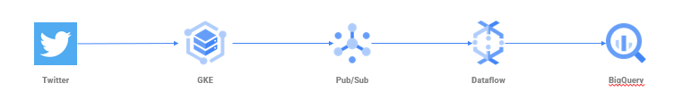

# twitter-processing-container

The goal is to intercept some tweets using GKE containers, and stream them to a pipeline:
<figure><figcaption>Twitter processing architecture</figcaption></figure>

To help keep the costs down, I've figured out how to use Deployment Manager to deploy and destroy the cluster on demand.

Next step is to integrate the [Pub/Sub emulator](https://medium.com/google-cloud/things-i-wish-i-knew-about-pub-sub-part-3-b8947b49224b).
